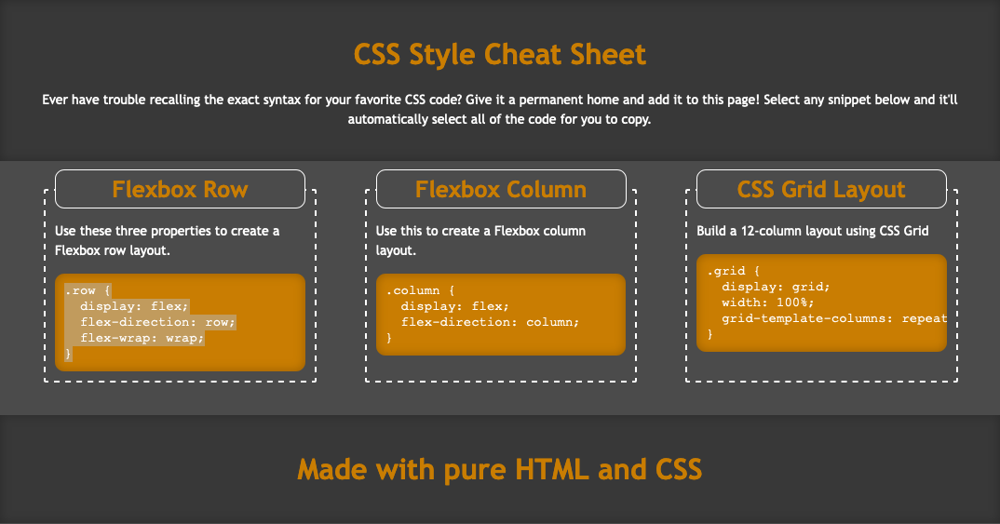

# miniproject-02
A CSS cheat sheet website. I was mainly focusing on learning on how to use flexboxes. This project is a great example to practice on because it is a sheet that needs to be organized a certain way.

I was also practicing responsive design since those boxes must be sized correctly which also affects it's positioning on the page.

### Screenshot
